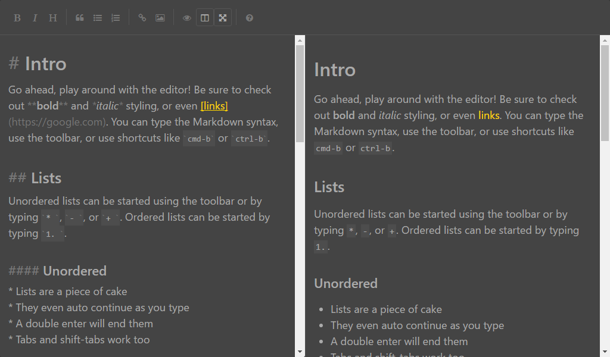

# SimpleMDE Theme Dark

[](https://greenkeeper.io/)

Forked from [SimpleMDE Theme Base](https://github.com/xcatliu/simplemde-theme-base).

> The dark theme for [SimpleMDE](https://simplemde.com/).

- [Demo](http://simplemde-theme-dark.mazimd.com/)
- [List of themes](https://github.com/xcatliu/simplemde-theme-base/wiki/List-of-themes)

## Screenshot



## How to use

First, follow [SimpleMDE official guide](https://github.com/NextStepWebs/simplemde-markdown-editor#install) to initial your editor.

Second, replace
```
https://cdn.jsdelivr.net/simplemde/latest/simplemde.min.css
```
with
```
https://cdn.rawgit.com/xcatliu/simplemde-theme-dark/master/dist/simplemde-theme-dark.min.css
```

That all, there is no step three.

## License

MIT

## Thanks

Thanks to [SimpleMDE](https://github.com/NextStepWebs/simplemde-markdown-editor) for the great editor and [Mobi.css](https://github.com/NextStepWebs/simplemde-markdown-editor) for the inspiration of styling.
